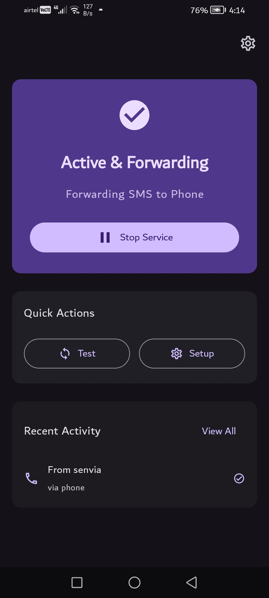
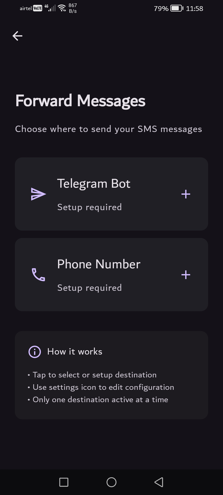
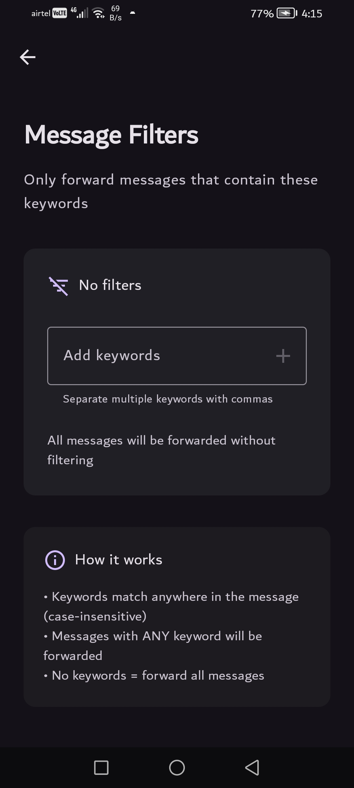

  
  <h1>Senvia 📱</h1>
  <strong>Android app to forward SMS</strong>

  
  
  

## 📸 Screenshots

  
  
  

## 🚀 What Senvia Does

Senvia automatically forwards your incoming SMS messages to:
- **🤖 Telegram Bot** - Receive SMS in your Telegram chat
- **📱 Another Phone** - Forward SMS to any phone number

**Key Features:**
- ⚡ **Instant Forwarding** - SMS forwarded immediately when received
- 🔒 **Private & Secure** - No external servers, direct forwarding only
- 🎯 **Filter Messages** - Choose which SMS to forward (optional)
- 🔄 **Background Service** - Works even when app is closed
- 🚀 **Auto-start** - Continues working after device reboot

## 📥 Download

### Latest Release
Download the latest APK from [Releases](https://github.com/menhazalam/senvia/releases)

### ⚠️ Installation Warning
Google Play Protect may warn about this app due to SMS permissions:
1. Tap **"More details"** → **"Install anyway"**
2. Or temporarily disable Play Protect: Play Store → Profile → Play Protect → Turn off

## 🔧 Setup

### 1. Install & Grant Permissions
- Install the APK
- Grant **SMS** and **Notification** permissions
- Disable **Battery Optimization** for reliable forwarding

### 2. Choose Forwarding Method

#### Option A: Telegram Bot
1. Create a Telegram bot:
   - Message [@BotFather](https://t.me/botfather)
   - Send `/newbot` and follow instructions
   - Copy the **Bot Token**
2. Get your Chat ID:
   - Message [@userinfobot](https://t.me/userinfobot)
   - Copy your **Chat ID**
3. Enter both in the app

#### Option B: Phone Number
1. Enter the destination phone number
2. Ensure your device can send SMS

### 3. Enable Auto-Start (Optional)
For auto-start after reboot, enable in device settings:

#### Samsung
- Settings → Apps → Senvia → Battery → Optimize battery usage → Don't optimize
- Settings → Apps → Senvia → Permissions → Auto-start → Allow

#### OnePlus
- Settings → Battery → Battery Optimization → Senvia → Don't optimize
- Settings → Apps → Auto-launch → Senvia → Enable

#### Xiaomi/MIUI
- Settings → Apps → Manage apps → Senvia → Autostart → Enable
- Settings → Apps → Manage apps → Senvia → Battery saver → No restrictions

#### Huawei
- Settings → Battery → App launch → Senvia → Manage manually → Enable all
- Phone Manager → Protected apps → Senvia → Enable

## ❓ Common Questions

### Why does Google Play Protect warn about this app?
SMS forwarding apps trigger security warnings because they:
- Read SMS messages (required for forwarding)
- Can auto-start (to work after reboot)
- Access internet (to send to Telegram)

**This is normal** - the warnings are false positives for legitimate SMS forwarding.

### Is my SMS data safe?
Yes! Senvia:
- ✅ Processes SMS locally on your device only
- ✅ Forwards directly to your chosen destination
- ✅ Doesn't store or collect any SMS data
- ✅ No external servers involved

### Why isn't SMS forwarding working?
1. Grant SMS permissions when prompted
2. Disable battery optimization for Senvia
3. For Telegram: Check internet connection
4. For Phone: Ensure device can send SMS

### How to make it work after phone restart?
Enable auto-start permissions in your device settings (see setup guide above).

## 📄 License

This project is licensed under the MIT License - see the [LICENSE](LICENSE) file for details.

## 📞 Support

- **Issues**: [GitHub Issues](https://github.com/menhazalam/senvia/issues)

## ⚠️ Disclaimer

This app is for legitimate SMS forwarding purposes only. Users are responsible for:
- Complying with local laws and regulations
- Respecting privacy of SMS senders
- Using the app ethically and responsibly

---

**Made with ❤️ for Android users who need reliable SMS forwarding**
